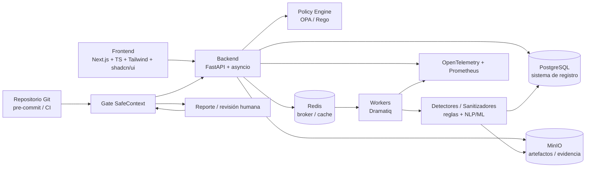
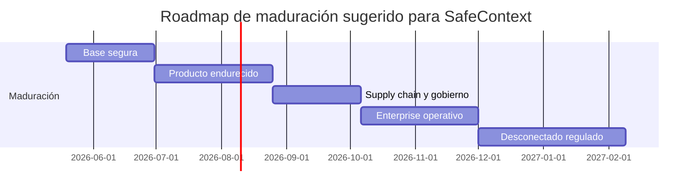

# Madurez técnica de SafeContext

## Resumen ejecutivo

La propuesta técnica de **SafeContext** parte de una base tecnológica sólida y contemporánea: **FastAPI** se presenta como framework “high performance” y “ready for production”; **Python 3.12** sigue soportado hasta **2028-10** aunque ya se encuentra en fase de **security fixes only**; **Next.js** ofrece **TypeScript built-in**, componentes de servidor/cliente, *streaming* y *self-hosting* sobre Node o Docker; **PostgreSQL** aporta **JSONB**, **Row-Level Security**, alta disponibilidad y cifrado TLS; **Redis** ofrece persistencia y escalado horizontal; **MinIO** aporta compatibilidad **S3**, *object locking* tipo **WORM**, cifrado del lado servidor y *erasure coding*; y **Docker** permite empaquetado reproducible, mientras que **Kubernetes** añade orquestación y autoescalado cuando la topología lo exige. Es decir: **los componentes individuales son maduros**. citeturn12view0turn33view0turn12view3turn12view4turn12view5turn13view0turn13view1turn13view2turn25search2turn13view5turn13view6turn13view8turn25search3turn16view6turn12view7turn12view8turn24search0

Sin embargo, **madurez de componentes** no equivale a **madurez de producto**. Para alcanzar un nivel alto en una empresa con exigencias serias de seguridad, la propuesta necesita controles que todavía no aparecen explícitos en el diseño base: **SSDF** y prácticas de desarrollo seguro, **ASVS/SAMM** para verificación y madurez de seguridad de aplicaciones, **AI RMF** para trazabilidad, explicabilidad y gobierno del componente de IA, **zero trust**, **policy-as-code**, **SBOM**, **provenance/SLSA**, **firma de artefactos**, **auditoría inmutable**, separación clara entre **sistema de registro** y **sistema de colas**, y una estrategia formal para operación **offline** o **air-gapped**. Sin esos elementos, la propuesta puede ser desplegable, pero no todavía auditable ni defendible ante un comité serio de seguridad o cumplimiento. citeturn12view9turn12view10turn12view11turn12view12turn13view13turn13view11turn13view12turn13view15turn22search2turn16view4

Mi evaluación global, usando la escala pedida, es: **MVP**. La razón es simple: el stack ya permite construir un sistema real, utilizable y escalable a corto plazo, pero todavía **no** define los controles operativos, de seguridad y de cumplimiento que distinguen un **Producto** repetible de un **Enterprise-grade**. Mi lectura crítica es esta: **la pila está a nivel Producto; la propuesta, tal como está formulada, sigue a nivel MVP**. citeturn12view0turn12view3turn12view7turn12view9turn12view10turn12view11turn12view12

La mejor noticia es que el camino de maduración es razonable. Con un roadmap enfocado en **control plane + workers**, persistencia duradera en **PostgreSQL** para evidencia y auditoría, **Redis** tratado como componente efímero y no como fuente de verdad, **MinIO** como repositorio de artefactos con retención y cifrado, **OpenTelemetry/Prometheus** para trazabilidad operativa, y un pipeline con **OIDC**, **SBOM**, **Cosign** y puertas de aprobación humana, SafeContext puede evolucionar de forma creíble hacia **Producto** y, con más disciplina operativa, hacia **Enterprise-grade**. citeturn16view3turn13view3turn13view8turn25search3turn12view15turn16view0turn16view2turn27search0turn13view11turn13view12turn27search7

## Marco de evaluación y arquitectura

La evaluación se centra en la **propuesta técnica**, no en una implementación ya operativa. Por eso el juicio está basado en dos capas. La primera es la **capacidad objetiva del stack** según documentación oficial. La segunda es la **distancia** entre el stack y las exigencias de una plataforma empresarial para manejo seguro de documentos, configuración sensible y datos que luego serán consumidos por IA. Para medir esa distancia, la referencia correcta no es solo la documentación de producto, sino también marcos como **NIST SSDF**, **NIST AI RMF**, **OWASP ASVS**, **OWASP SAMM**, **Zero Trust** y controles de cadena de suministro como **SLSA**, **SBOM** y firma de artefactos. citeturn12view9turn12view10turn12view11turn12view12turn13view13turn13view15turn13view11turn13view12

La escala usada en este informe es la siguiente. **Concepto** significa viabilidad técnica inicial, sin garantías no funcionales. **MVP** significa sistema desplegable y verificable, con controles parciales. **Producto** implica operación repetible, observabilidad útil, seguridad integrada y procesos estándar de entrega. **Enterprise-grade** exige además trazabilidad auditable, segregación de funciones, gobierno de modelos y políticas, operación desconectada cuando el contexto lo requiera, y evidencia verificable de integridad y cumplimiento. Esta definición es una síntesis razonada de SSDF, AI RMF, ASVS, SAMM, Zero Trust y SLSA. citeturn12view9turn12view10turn12view11turn12view12turn13view13turn13view15

La arquitectura más madura para este stack no es monolítica “full stack” en sentido estricto, sino una arquitectura con **control plane**, **workers**, **repositorio de evidencias**, **motor de políticas** y **gates** de integración con repositorios y CI/CD. Esa separación es coherente con las recomendaciones de FastAPI para contenedores y un proceso por contenedor en orquestadores, con el modelo de *self-hosting* y caché distribuida de Next.js, y con el uso de Redis/colas solo para trabajo transitorio mientras PostgreSQL conserva el registro duradero. citeturn30view0turn13view9turn16view3turn13view3

## Evaluación por criterio

El stack permite un diseño correcto, pero también deja varios “falsos amigos”. El más importante es **Redis**: oficialmente escala horizontalmente con **Redis Cluster**, pero la misma especificación advierte que usa **replicación asíncrona** y que existen ventanas en las que pueden perderse escrituras ya reconocidas durante particiones o *failover*. Por tanto, usar Redis como único registro de trabajos, auditoría o decisiones de política sería un error serio para un producto con pretensiones enterprise; ese papel debe recaer en **PostgreSQL** y, si hace falta, en un patrón **outbox/event log** persistente. citeturn13view6turn16view3

El segundo punto crítico es **Next.js en multi-instancia**. La guía oficial de *self-hosting* indica que la caché por defecto vive en disco local, funciona bien en una sola instancia, pero cuando hay múltiples instancias o *ephemeral compute* es necesario revisar la coordinación de caché y, si hace falta, usar un *custom cache handler* compartido, por ejemplo con **Redis**. Si este detalle no se diseña desde el inicio, el sistema acaba con UI inconsistente, invalidaciones parciales y comportamientos difíciles de explicar en producción. citeturn13view9

El tercer punto es el plano de seguridad y cumplimiento. **PostgreSQL** sí aporta piezas clave —**JSONB**, **RLS** con *default deny*, alta disponibilidad y TLS— pero nada de eso sustituye decisiones de diseño sobre clasificación de datos, trazabilidad, rotación de claves, exportación/borrado regulatorio, o auditoría detallada mediante **pgAudit**. Lo mismo aplica a **MinIO**: dispone de compatibilidad **S3**, **WORM/object locking**, *erasure coding* y cifrado del lado servidor, pero esas capacidades solo generan madurez si se activan y se gobiernan. citeturn13view0turn13view1turn13view2turn13view3turn25search2turn13view8turn16view6turn25search3

| Criterio | Estado actual | Gaps principales | Riesgo dominante | Madurez estimada | Base de juicio |
|---|---|---|---|---|---|
| Arquitectura | Correcta para separar UI, API, cola, DB y objetos; el stack soporta contenedores, *self-hosting* y crecimiento por capas. | Falta definir límites de dominio, eventos, modelo de evidencias y qué componente es fuente de verdad. | Acoplamiento oculto y rediseño temprano. | MVP | FastAPI es “ready for production”; Next.js se autoalberga; Compose/K8s soportan la topología. citeturn12view0turn13view9turn12view7turn12view8 |
| Seguridad | El stack soporta OAuth2/JWT, TLS, RLS, SSE y WORM. | Falta SSO/MFA, secretos centralizados, KMS, *policy-as-code*, *zero trust*, firma de artefactos y permisos finos. | Brechas por configuración, secretos y accesos laterales. | MVP | FastAPI documenta OAuth2/JWT; PostgreSQL soporta TLS y RLS; MinIO aporta SSE/WORM; Zero Trust pide authz explícita. citeturn30view2turn25search2turn13view1turn13view8turn13view13 |
| Escalabilidad | Buena base horizontal: FastAPI por contenedor, Redis Cluster, K8s/HPA y MinIO distribuido. | No hay estrategia explícita de *backpressure*, particionado, prioridades ni coordinación de caché de Next.js. | Degradación errática cuando sube volumen o concurrencia. | MVP | FastAPI recomienda un proceso por contenedor en K8s; Redis Cluster y HPA existen; Next.js exige coordinación de caché multiinstancia. citeturn30view0turn13view6turn24search0turn13view9 |
| Operatividad | Docker y Compose aceleran instalación, desarrollo y despliegue inicial. | Faltan *runbooks*, backups probados, DR, *health model*, *graceful shutdown* y estrategia de upgrades. | Operación artesanal y recuperación lenta. | MVP | Compose simplifica el ciclo de vida; Next.js recomienda *reverse proxy* y *graceful shutdown*; FastAPI se apoya en Docker/K8s. citeturn12view7turn13view9turn30view0 |
| Observabilidad | Hay base excelente con OpenTelemetry, Prometheus y middleware Prometheus de Dramatiq. | Falta definir trazas extremo a extremo, correlación UI→API→worker→artefacto y SLIs/SLOs. | Incidentes difíciles de diagnosticar y auditar. | MVP | OTel unifica trazas/métricas; Prometheus recomienda instrumentar todo; Dramatiq tiene middleware Prometheus. citeturn12view15turn16view0turn20view0 |
| Compliance | Hay piezas técnicas útiles para GDPR/HIPAA: minimización posible, cifrado, auditoría, retención. | Falta catálogo de datos, borrado/exportación, retención por clase, audit trail y segregación de funciones. | Cumplimiento documental débil aunque la plataforma “funcione”. | Concepto–MVP | GDPR insiste en minimización y propósito; HIPAA exige salvaguardas administrativas, físicas y técnicas; pgAudit ayuda a auditoría. citeturn12view13turn12view14turn13view3 |
| IA/ML readiness | Python baja la fricción para integrar Presidio, spaCy, Transformers y PyTorch. | Falta evaluación de detectores, *dataset management*, umbrales de confianza, explicabilidad y revisión humana. | Falsos negativos o redacciones no justificables. | MVP | Presidio detecta/anonomiza PII; spaCy es NLP “industrial-strength”; Transformers/PyTorch encajan en Python; AI RMF exige validez, transparencia y explicabilidad. citeturn11search0turn11search1turn11search2turn11search14turn11search7turn12view10 |
| DevSecOps | Integración natural con GitHub/GitLab/Azure; OIDC, protección de despliegues, SBOM y firma están disponibles. | Falta pipeline formal: OIDC obligatorio, escaneo, SBOM, provenance, firma, políticas y aprobación humana. | Cadena de suministro sin garantías verificables. | MVP | GitHub Actions soporta CI/CD, OIDC y *deployment protection rules*; Docker genera SBOM; Cosign firma; SLSA formaliza provenance. citeturn23search11turn27search0turn27search7turn13view11turn13view12turn13view15 |
| Experiencia de desarrollador | Muy fuerte: FastAPI, OpenAPI implícita, TS integrado, Tailwind ágil, shadcn controlable, Compose local. | shadcn/ui aumenta propiedad del código; faltan ADRs, plantillas, convenciones y SDKs internos. | Velocidad alta al inicio pero divergencia de estilos a medio plazo. | Producto | Next.js trae TS nativo; Tailwind acelera y facilita mantenimiento; shadcn/ui da control porque “no es una component library” tradicional. citeturn12view3turn26view0turn12view6 |
| Mantenibilidad | Buena si se hace modular: API clara, workers separados, PostgreSQL como registro y MinIO como evidencia. | Faltan versionado de políticas, compatibilidad entre detectores, contratos de eventos y pruebas de regresión. | Acumulación de deuda semántica. | MVP | SSDF y SAMM empujan prácticas medibles, integrables y orientadas al ciclo completo. citeturn12view9turn12view12 |
| Coste | Coste inicial razonable con OSS y Docker; Compose reduce overhead temprano. | El coste sube con compliance, HA, caching distribuido, KMS, firmas y operación 24x7; además hay revisión legal por licencias de Redis 8 y MinIO CE. | TCO subestimado y sorpresa en fase de hardening. | Producto en CAPEX inicial, MVP en TCO real | Redis 8 usa *tri-license*; MinIO CE es AGPLv3 mientras AIStor usa licencia comercial; K8s añade control pero también complejidad operativa. citeturn13view4turn13view7turn10search3turn12view8 |

La lectura consolidada de la tabla es clara. **Arquitectura, DX y coste de entrada** están relativamente maduros. **Seguridad, compliance, observabilidad, DevSecOps e IA/ML governance** todavía no. Ese patrón es típico de una propuesta tecnológicamente bien elegida pero aún no “cerrada” para auditoría o escalado institucional. citeturn12view9turn12view10turn12view11turn12view12

## Nivel de madurez global

Si el criterio fuera solo “¿puedo construir algo serio con esto?”, la respuesta sería sí. El stack no es experimental; al contrario, está apoyado en tecnologías con documentación madura, patrones de despliegue conocidos y capacidades reales de crecimiento. Por eso **SafeContext no está en Concepto**. Tampoco sería correcto llamarlo “demo”. El problema está en otra parte: **todavía no hay suficiente definición de controles** para afirmar repetibilidad operacional, trazabilidad fuerte y gobierno formal de seguridad/IA. citeturn12view0turn13view9turn13view2turn12view15

Tampoco lo clasificaría como **Producto** todavía. Para llegar ahí, la propuesta debería describir al menos: modelo de identidad y autorización, matriz de roles, convenciones de versionado de políticas, estrategia de caché compartida en Next.js, patrón de persistencia durable para audit trail y jobs, modelo de evidencia inmutable, backup/restore ensayado, telemetría por correlación de artefacto, y pipeline con OIDC + SBOM + firma + *deployment gates*. Ninguno de esos puntos es accesorio en una herramienta que va a tocar documentos sensibles y que además quiere habilitar consumo seguro por IA. citeturn13view9turn13view3turn27search0turn13view11turn13view12turn27search7

Mucho menos está en **Enterprise-grade**. Para eso faltan, de forma explícita, requisitos como despliegue **air-gapped**, operación **offline-capable**, evidencia de intrusión y auditoría, *policy-as-code*, explicabilidad de decisiones, revisión humana obligatoria en puntos de alto impacto, segregación de funciones y cadena de suministro verificable. Eso ya no es “nice to have”: es justo lo que piden los marcos de referencia que una empresa seria usaría para aceptarlo. citeturn16view4turn12view10turn22search2turn27search7turn12view9turn14search0

Mi clasificación final es, por tanto, **MVP**, con esta precisión útil: **MVP alto**, porque la tecnología no te ata las manos; y **producto potencial**, porque la mayoría de los gaps son de diseño operativo y de control, no de incapacidad intrínseca del stack. Eso es importante: no hace falta cambiar medio stack para madurar; hace falta **disciplinarlo**. citeturn12view0turn12view3turn13view2turn12view15turn13view11turn13view12

## Roadmap priorizado y métricas

El orden correcto de maduración no es “más features primero”. Es **primero trazabilidad y control**, luego escalado y cumplimiento. Las fases propuestas abajo están priorizadas con ese criterio y se apoyan en SSDF, AI RMF, DORA, Golden Signals, OTel/Prometheus y controles de *software supply chain*. citeturn12view9turn12view10turn15view0turn13view17turn12view15turn16view0turn13view11turn13view12turn13view15

| Fase | Duración estimada | Dependencias | Entregables clave | Recursos clave | Criterios de aceptación |
|---|---:|---|---|---|---|
| Base segura | 4–6 semanas | Ninguna | ADRs, modelo de dominio, threat model, clasificación de datos, esquema de evidencia, PostgreSQL como sistema de registro, Redis solo como broker/cache, trazas OTel, métricas Prometheus, *reverse proxy* para Next.js, Dockerfiles multi-stage | Arquitecto, backend, DevOps, seguridad | Todas las operaciones críticas generan `trace_id`, `artifact_digest`, `policy_version`; despliegue reproducible en Docker; p95 API bajo carga base definido y monitorizado; Redis deja de ser fuente de verdad |
| Producto endurecido | 6–8 semanas | Base segura | RLS, pgAudit, SSE/KMS y versionado/retención en MinIO, cache handler distribuido para Next.js, colas idempotentes, retries y DLQ, backups y prueba de restore | Backend, frontend, DBA, plataforma | Restore probado; auditoría detallada habilitada; caché multiinstancia consistente; artefactos cifrados y con retención; trabajos idempotentes con reintento controlado |
| Supply chain y gobierno | 4–6 semanas | Producto endurecido | OIDC en CI, SBOM, provenance/SLSA, firma Cosign, puertas de despliegue, excepción con aprobación humana, políticas OPA/Rego | DevOps, AppSec, plataforma | 100% de imágenes firmadas y con SBOM; no quedan secretos de larga vida en CI; despliegue bloqueado si falla política o firma; excepciones quedan auditadas con aprobador |
| Enterprise operativo | 6–8 semanas | Supply chain y gobierno | SSO/MFA, segregación de funciones, exportación de auditoría, revisión humana por severidad/confianza, runbooks, ejercicios DR, soporte offline | Plataforma, seguridad, compliance, operaciones | RTO/RPO verificados; revisión humana para hallazgos de alta criticidad o baja confianza; evidencia exportable para auditoría; operación estable con guardias y runbooks |
| Desconectado regulado | 6–10 semanas | Enterprise operativo | Instalación air-gapped, registry privado, runners/agentes self-hosted, bundles offline, proceso de actualización y rollback desconectado | Plataforma, seguridad, infra on-prem | Instalación completa sin internet; actualización y rollback documentados y probados; el producto funciona con dependencias externas deshabilitadas |

Para medir la madurez no alcanza con “tener checklists”. Conviene mezclar **métricas de entrega**, **métricas de servicio** y **métricas de calidad del sanitizado**. DORA recomienda observar *change lead time*, *deployment frequency*, *failed deployment recovery time* y *change fail rate*; Google SRE recomienda como mínimo **latency, traffic, errors, saturation**; Prometheus y OpenTelemetry dan la instrumentación base para llevarlo a la práctica. citeturn15view0turn15view1turn13view17turn12view15turn16view0turn16view1turn16view2

| Dimensión | KPI sugerido | Meta para pasar de MVP a Producto | Meta para aspirar a Enterprise-grade |
|---|---|---|---|
| Calidad del sanitizado | Recall de secretos/PII en corpus etiquetado | ≥ 0,95 en clases críticas | ≥ 0,98 con validación continua |
| Calidad del sanitizado | Tasa de *false positives* revisados por humanos | Baseline y reducción sostenida | < 10% en clases críticas |
| Gobierno | % de decisiones con explicación (`rule_id`, detector, confianza, versión de política) | ≥ 90% | 100% |
| Auditoría | % de operaciones críticas con `trace_id` + `artifact_digest` + actor | ≥ 95% | 100% e inmutabilidad probada |
| Supply chain | % de imágenes con SBOM + provenance + firma | ≥ 80% | 100% |
| Seguridad | % de despliegues con OIDC y sin secretos persistentes | ≥ 80% | 100% |
| Observabilidad | Cobertura de trazas en API y workers | ≥ 80% | ≥ 95% |
| Servicio | p95 de latencia de API y p95 de tiempo total de sanitización por artefacto | SLO definidos y medidos | SLO con error budget operativo |
| Resiliencia | Éxito de backup/restore y DR drills | Restore mensual exitoso | DR trimestral con RTO/RPO aceptados |
| Entrega | Deployment frequency, lead time, failed deployment recovery time, change fail rate | Captura estable y mejora sostenida | Uso como *guardrail* directivo, no solo reporte |

## Alternativas, requisitos enterprise y riesgos

En elecciones de plataforma, mi criterio no sería “la herramienta más popular”, sino “la que minimiza complejidad total para este producto”. En ese marco, **Next.js** me parece mejor alineado que **Blazor** para SafeContext, no porque Blazor sea débil —de hecho ofrece SSR estática, SSR interactiva, WebAssembly y modo automático— sino porque tu backend es Python, no .NET, y en ese caso Next.js aprovecha mejor el ecosistema web moderno, la integración nativa con TypeScript, el *streaming*, el *self-hosting* y la composición UI con Tailwind/shadcn. Blazor sigue siendo una alternativa totalmente válida si la organización es fuertemente .NET, busca compartir modelos/habilidades C#, o prioriza coherencia de stack interno por encima de velocidad de iteración en UX web. citeturn17view0turn12view3turn12view4turn12view5turn13view9turn12view6turn26view0

En *workers*, **Dramatiq** es una elección razonable si SafeContext ejecuta tareas mayormente idempotentes de escaneo, redacción, clasificación y persistencia, porque soporta **Redis/RabbitMQ**, trae *middleware* de **retries**, límites de tiempo, *Pipelines*, AsyncIO y Prometheus, y mantiene el modelo mental simple. **Celery** es más maduro si anticipas **workflows complejos**, primitivas tipo **group/chain/chord**, o necesidades extensas de scheduling y ecosistema. Mi lectura crítica: **Dramatiq = mejor default para empezar bien**; **Celery = mejor apuesta si desde el primer año prevés orquestación compleja**. citeturn12view16turn20view0turn12view17turn18view0turn19search0

En orquestación, **Docker Compose** es excelente para desarrollo, pilotos, *single-node on-prem* y primeras instalaciones controladas; la propia documentación indica que Compose funciona en producción, *staging*, desarrollo, pruebas y CI. Pero eso no lo convierte mágicamente en orquestador de clase enterprise. **Kubernetes** sí aporta automatización de despliegue, escalado y gestión; además, **HPA** puede ajustar réplicas según métricas y Docker ya ofrece **Compose Bridge** para convertir configuraciones Compose en manifiestos Kubernetes. Mi recomendación crítica es: **Compose como formato y experiencia de arranque; Kubernetes cuando haya multiinstancia, HA, autoescalado, multi-tenant o exigencia regulatoria real**. citeturn12view7turn12view8turn24search0turn24search2

| Decisión | Opción preferida ahora | Cuándo gana la alternativa | Trade-off real |
|---|---|---|---|
| Frontend | Next.js + TypeScript | Blazor gana en organizaciones muy .NET, con fuerte reutilización de C# y menos exigencia de ecosistema web moderno | Next.js acelera UX y desacopla mejor; Blazor reduce *context switching* en equipos C# |
| Cola/workers | Dramatiq | Celery gana si necesitas DAGs, chord/group/chain, scheduling más rico y ecosistema amplio | Dramatiq simplifica; Celery da más potencia pero más superficie operativa |
| Orquestación | Docker Compose al inicio | Kubernetes gana con HA, HPA, multi-node, políticas y operación empresarial | Compose baja coste inicial; Kubernetes baja riesgo a escala pero sube complejidad y TCO operativo |

Para ser **Enterprise-grade**, SafeContext debería exigir, como mínimos técnicos no negociables, lo siguiente. **Offline-capable**: ningún flujo crítico debe depender obligatoriamente de SaaS externos. **Audit trail fuerte**: cada decisión debe registrar actor, artefacto, regla, versión de política, hashes y correlación de trazas; para la base de datos, **pgAudit** es una pieza útil. **Explainability**: cada detección y cada redacción deben ser explicables, no solo “resultado del modelo”; el AI RMF exige sistemas válidos, seguros, transparentes y explicables. **Policy-as-code**: reglas de sanitizado, clasificación, despliegue y excepciones versionadas y evaluadas con un motor como **OPA/Rego**. **Human review**: aprobaciones obligatorias para excepciones, hallazgos de baja confianza o acciones irreversibles; GitHub Actions puede implementar esto con reglas de protección y revisores requeridos. **Air-gapped deployment**: soporte documentado para despliegue y operación en redes aisladas, con registry privado, agentes self-hosted y control de egress. citeturn13view3turn12view10turn22search2turn22search1turn27search7turn16view4turn28search2turn29search3

| Requisito enterprise | Evidencia mínima exigible |
|---|---|
| Offline-capable | El producto opera sin servicios externos obligatorios para sanitizar, auditar y aprobar |
| Audit trail | Toda decisión lleva `trace_id`, `policy_version`, `artifact_digest`, actor y sello temporal exportable |
| Explainability | Cada hallazgo incluye detector, regla, span afectado y confianza |
| Policy-as-code | Reglas versionadas, testeadas y desplegadas por pipeline |
| Human review | Excepciones y hallazgos críticos exigen aprobación humana registrada |
| Air-gapped | Instalación, actualización y rollback probados sin acceso a internet |

Los riesgos críticos más importantes, en mi opinión, son ocho. **Primero**, tratar Redis como fuente canónica; mitigación: PostgreSQL como sistema de registro y Redis solo efímero. **Segundo**, subestimar el problema de caché compartida en Next.js; mitigación: *custom cache handler* y pruebas multiinstancia. **Tercero**, usar MinIO/Redis sin revisión legal de licencia/versionado; mitigación: decisión explícita de edición y *legal review*. **Cuarto**, dejar la seguridad “para después”; mitigación: OIDC, firma, SBOM y *deployment gates* desde la primera fase. **Quinto**, pretender “IA segura” sin explicabilidad ni revisión humana; mitigación: esquema de decisión explicable y umbrales de confianza. **Sexto**, no probar restauración; mitigación: backups y DR *drills*. **Séptimo**, excesiva confianza en Compose para instalaciones complejas; mitigación: umbral claro de migración a K8s. **Octavo**, deuda de UI por uso indiscriminado de shadcn/Tailwind sin sistema de diseño interno; mitigación: tokens, componentes base y ADRs. citeturn16view3turn13view9turn13view4turn13view7turn27search0turn13view11turn13view12turn12view10turn12view7turn24search0turn12view6turn26view0

Como base documental priorizada para el proyecto, yo pondría primero los **estándares y publicaciones oficiales**: **NIST SSDF**, **NIST AI RMF**, **NIST Zero Trust**, **OWASP ASVS**, **OWASP SAMM**, **OWASP GenAI**, **GDPR** y **HIPAA Security Rule**. En segundo nivel, la **documentación oficial de cada tecnología**: FastAPI, Python, Next.js, PostgreSQL, Redis, Dramatiq, Celery, MinIO, Docker, Kubernetes, OpenTelemetry y Prometheus. En tercer nivel, herramientas enterprise de hardening de cadena de suministro y gobierno: **SLSA**, **Docker SBOM**, **Cosign** y **OPA**. Esa jerarquía de fuentes es la adecuada para que SafeContext no se convierta en “otra app útil”, sino en un producto defendible ante seguridad, compliance y arquitectura empresarial. citeturn12view9turn12view10turn13view13turn12view11turn12view12turn21search0turn12view13turn12view14turn12view0turn12view3turn13view2turn13view6turn12view16turn12view17turn13view8turn12view7turn12view8turn12view15turn16view0turn13view15turn13view11turn13view12turn22search2